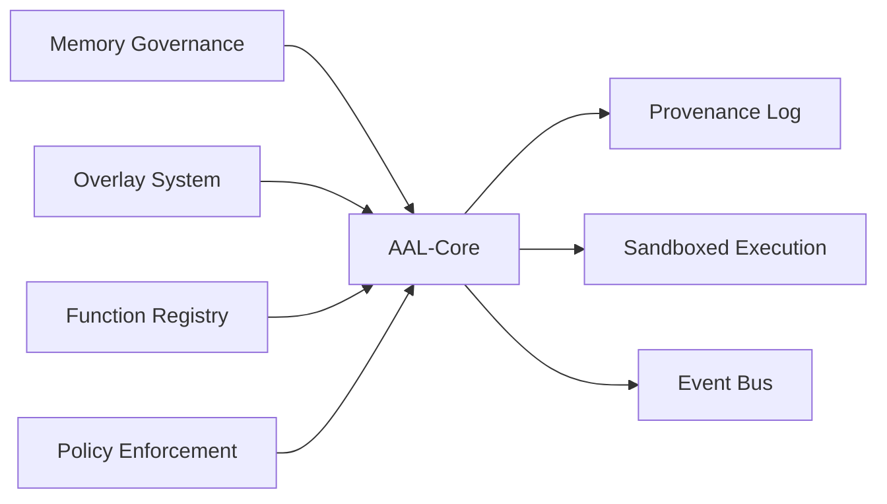
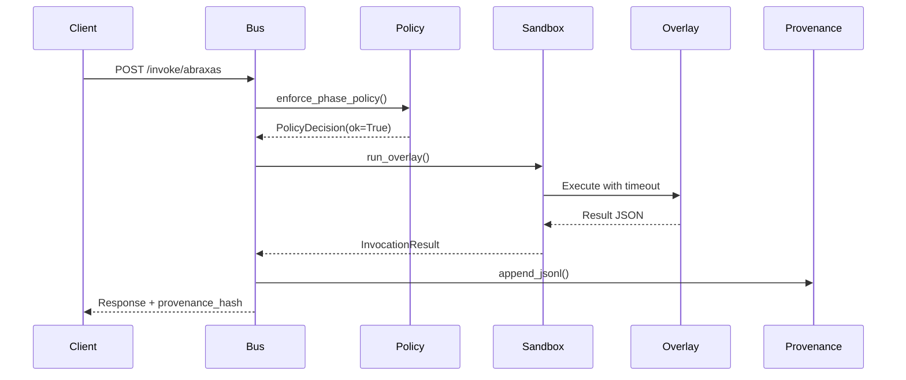

```
   _____          _             _____
  / ____|        | |           / ____|
 | (___    __ _  | |  ______  | |      ___    _ __   ___
  \___ \  / _` | | | |______| | |     / _ \  | '__| / _ \
  ____) || (_| | | |          | |____| (_) | | |   |  __/
 |_____/  \__,_| |_|           \_____|\___/  |_|    \___|

    Architecture Abstraction Layer - Core Engine
```

<div align="center">

**AAL-Core** • Deterministic Memory Governance • Overlay Orchestration • Dynamic Function Discovery

[]()
[]()
[]()
[]()

[Features](#-key-features) • [Quick Start](#-quick-start) • [Roadmap](#%EF%B8%8F-roadmap) • [Documentation](#-documentation) • [Architecture](#-architecture)

---

</div>

## 🌟 Overview

**AAL-Core** is a comprehensive architecture abstraction layer providing deterministic, modular systems for memory governance, overlay orchestration, and dynamic function discovery. Built for high-performance AI workloads with provenance tracking and capability enforcement.

**Current Phase:** Stabilization (Q1 2026) - See [ROADMAP.md](ROADMAP.md) for full roadmap through v3.0.

## 🚀 Key Features

### ✅ Integrated Systems (All Branches Merged)

<table>
<tr>
<td width="50%">

**Core Systems**
- 🧠 **ABX-Runes Memory Governance**
  - Declarative memory contracts
  - Automatic degradation under pressure
  - Multi-tier memory support
- 🌳 **YGGDRASIL-IR Metadata Layer**
  - Evidence bundles & provenance
  - Bridge promotion workflows
  - Hash-locked artifacts

</td>
<td width="50%">

**Execution & Discovery**
- 🔐 **Phase Policy Enforcement**
  - Granular capability control
  - Phase-aware permissions
- 🔍 **Dynamic Function Discovery**
  - Multi-source registry
  - Hash-based change detection
  - Event-driven updates

</td>
</tr>
<tr>
<td width="50%">

**Integration & Analytics**
- 📊 **BeatOven Metrics Integration**
  - Catalog aggregation
  - Performance tracking
- 🔮 **Oracle-Runes Integration**
  - SDS, IPL, ADD operators
  - Drift tracking & provenance

</td>
<td width="50%">

**Security & Alignment**
- 🛡️ **Abraxas Overlay System**
  - Analysis & prediction modules
  - Capability enforcement
- ⚖️ **Alignment Core**
  - Constitutional governance
  - Regime-based control
  - Objective firewall

</td>
</tr>
</table>

### 🎯 Core Capabilities



| Capability | Description | Status |
|------------|-------------|--------|
| **Runic Memory Contracts** | Declarative memory limits with behavior specs | ✅ Active |
| **RAM Stress Monitoring** | Real-time memory pressure (0-1 scalar) | ✅ Active |
| **Automatic Degradation** | Graceful fallback under resource constraints | ✅ Active |
| **KV Cache Management** | Policy-driven sizing and eviction | ✅ Active |
| **Multi-tier Memory** | LOCAL (DRAM) / EXTENDED (CXL) / COLD (disk) | ✅ Active |
| **Sandboxed Execution** | Subprocess isolation with timeout | ✅ Active |
| **Provenance Logging** | Deterministic replay capability | ✅ Active |

## 📦 Quick Start

### Installation

```bash
# Clone the repository
git clone https://github.com/scrimshawlife-ctrl/AAL-core.git
cd AAL-core

# Install dependencies
pip install -r requirements.txt

# Start the AAL-Core bus
uvicorn main:app --reload
```

### Basic Usage

#### 1. Memory Governance with ABX-Runes

```python
from abx_runes.memory_runes import parse_memory_profile
from abx_runes.scheduler_memory_layer import JobContext, MemoryAwareScheduler

# Define memory profile
RUNE_TEXT = """
MEM[SOFT=2048,HARD=4096,VOL=MED];
KV[CAP=0.2,POLICY=WINDOW,PURGE=ON_STRESS];
TIER=EXTENDED;
PRIORITY=7;
DEGRADE{
  STEP1:SHRINK_KV(0.75),
  STEP2:CONTEXT(4096),
  STEP3:DISABLE(HIGH_COST_METRICS),
  STEP4:BATCH(ASYNC),
  STEP5:OFFLOAD(EXTENDED)
}
"""

profile = parse_memory_profile(RUNE_TEXT)

# Create scheduler
def run_job(job: JobContext):
    # Your job logic here
    pass

scheduler = MemoryAwareScheduler(run_job)

# Submit job
job = JobContext(job_id="oracle-001", profile=profile, metadata={})
result = scheduler.submit(job)
```

#### 2. Invoke an Overlay

```bash
curl -X POST "http://127.0.0.1:8000/invoke/abraxas" \
  -H "Content-Type: application/json" \
  -d '{
    "phase": "CLEAR",
    "data": {
      "prompt": "Analyze system state",
      "intent": "diagnostic"
    }
  }' | jq .
```

#### 3. Query Function Registry

```bash
# Get current function catalog
curl http://127.0.0.1:8000/functions | jq .

# Force refresh and detect changes
curl -X POST http://127.0.0.1:8000/functions/refresh | jq .

# View event bus history
curl http://127.0.0.1:8000/events?limit=20 | jq .
```

## 🏗️ Architecture

### High-Level Overview

```
┌─────────────────────────────────────────────────────────────┐
│                         AAL-Core Bus                         │
│  ┌──────────────┐  ┌──────────────┐  ┌──────────────┐      │
│  │   Overlay    │  │   Function   │  │    Event     │      │
│  │   Registry   │  │   Registry   │  │     Bus      │      │
│  └──────────────┘  └──────────────┘  └──────────────┘      │
│          │                  │                  │             │
│          └──────────────────┴──────────────────┘             │
│                          │                                   │
│                ┌─────────▼─────────┐                        │
│                │  Policy Engine    │                        │
│                │ (Phase Enforcement)│                       │
│                └─────────┬─────────┘                        │
│                          │                                   │
│                ┌─────────▼─────────┐                        │
│                │ Sandbox Executor  │                        │
│                └─────────┬─────────┘                        │
│                          │                                   │
└──────────────────────────┼───────────────────────────────────┘
                           │
            ┌──────────────┼──────────────┐
            │              │              │
     ┌──────▼──────┐ ┌────▼────┐ ┌──────▼──────┐
     │   Abraxas   │ │  Psy-Fi │ │ Custom      │
     │   Overlay   │ │ Overlay │ │ Overlays    │
     └─────────────┘ └─────────┘ └─────────────┘
```

### Directory Structure

<details>
<summary>📁 Click to expand full structure</summary>

```
AAL-core/
├── 📂 .aal/                           # Overlay definitions
│   └── overlays/
│       ├── abraxas/                   # Analysis & prediction
│       ├── abraxas_exec/             # Exec-capable variant
│       └── psyfi/                    # Simulation overlay
├── 📂 aal_core/                      # Core AAL modules
│   ├── alignment/                    # Constitutional layer
│   ├── bus/                          # Event bus & orchestration
│   ├── integrations/                 # External integrations
│   ├── registry/                     # Function registry
│   └── services/                     # Core services
├── 📂 abraxas/                       # Abraxas implementation
│   ├── oracle/                       # Oracle engine
│   └── runes/                        # Rune operators
├── 📂 abx_runes/                     # Memory governance
├── 📂 alignment_core/                # Alignment system
├── 📂 bus/                           # Bus infrastructure
│   ├── overlay_registry.py           # Manifest loading
│   ├── policy.py                     # Policy enforcement
│   └── sandbox.py                    # Sandboxed execution
├── 📂 engines/                       # State management
├── 📂 normalizers/                   # Sport normalizers
├── 📂 risk/                          # Entropy throttle
├── 📂 tests/                         # Test suite
├── 📂 TOOLS/                         # Utilities
│   ├── replay.py                     # Deterministic replay
│   └── orin_nano_prep.sh            # Jetson deployment
├── 📄 main.py                        # FastAPI server
├── 📄 README.md                      # This file
├── 📄 Claude.md                      # Developer docs
├── 📄 TODO.md                        # Task tracker
└── 📄 CANON.md                       # Architecture changelog
```

</details>

### Component Interaction



## 🔧 Configuration

### Memory Rune Syntax

#### Memory Rune (Required)
```
MEM[SOFT=<mb>,HARD=<mb>,VOL=<LOW|MED|HIGH>]
```
- `SOFT`: Target memory cap in MB
- `HARD`: Absolute memory limit in MB
- `VOL`: Memory churn rate tier

#### KV Cache Rune (Optional)
```
KV[CAP=<0.0-1.0>,POLICY=<LRU|WINDOW|TASK_BOUND>,PURGE=<ON_STRESS|ON_EVENT>]
```

#### Degradation Path (Optional)
```
DEGRADE{
  STEP1:SHRINK_KV(0.75),
  STEP2:CONTEXT(4096),
  STEP3:DISABLE(HIGH_COST_METRICS),
  STEP4:BATCH(ASYNC),
  STEP5:OFFLOAD(EXTENDED)
}
```

### Phase Configuration

| Phase | External I/O | Writes | Exec | Use Case |
|-------|-------------|--------|------|----------|
| **OPEN** | ✅ | ✅ | ❌ | Data loading & preparation |
| **ALIGN** | ✅ | ✅ | ❌ | Configuration & alignment |
| **ASCEND** | ✅ | ✅ | ✅ | Execution (requires `exec` capability) |
| **CLEAR** | ❌ | ❌ | ❌ | Read-only analysis |
| **SEAL** | ❌ | ✅ | ❌ | Results finalization |

### Environment Variables

```bash
# Enable full payload logging for replay
export AAL_DEV_LOG_PAYLOAD=1

# Set custom overlays directory
export AAL_OVERLAYS_DIR=/path/to/overlays

# Configure bus port
export AAL_PORT=8000
```

## 📊 API Reference

### Core Endpoints

| Method | Endpoint | Description |
|--------|----------|-------------|
| `GET` | `/` | Health check |
| `GET` | `/overlays` | List available overlays |
| `POST` | `/invoke/{overlay}` | Execute overlay with phase and data |
| `GET` | `/provenance?limit=N` | Retrieve provenance events |
| `GET` | `/events?limit=N` | Retrieve bus events |

### Function Registry Endpoints

| Method | Endpoint | Description |
|--------|----------|-------------|
| `GET` | `/functions` | Get current function catalog |
| `POST` | `/fn/rebuild` | Force catalog rebuild |
| `GET` | `/events` | View registry update events |

### Example Response: Invoke Overlay

```json
{
  "ok": true,
  "overlay": "abraxas",
  "phase": "CLEAR",
  "request_id": "abraxas-1703001234567",
  "result": {
    "analysis": "System nominal",
    "metrics": {"entropy": 0.42}
  },
  "timestamp_ms": 1703001234567,
  "payload_hash": "sha256:abc123..."
}
```

## 🧪 Testing

**Current Status:** 313 tests, 1 import error (99.7% collection rate)

```bash
# Run all tests
python -m pytest tests/ -v

# Run specific subsystem tests
python -m pytest tests/test_policy_enforcement.py -v
python -m pytest tests/test_memory_runes.py -v
python -m pytest tests/test_overlay_dispatch.py -v

# Run with coverage
python -m pytest tests/ --cov=aal_core --cov-report=html

# Check test collection status
python -m pytest tests/ --co -q
```

**Recent Improvements:**
- ✅ Fixed 10 import errors across effects_store, portfolio modules, and renderers
- ✅ Added missing functions: `get_effect_mean`, `save_effects`, `load_effects`, `stderr`, `variance`
- ✅ Restored `render()` function in luma pipeline
- ✅ Added `SvgStaticRenderer` and `SvgRenderConfig` classes
- 🔄 1 legacy test needs API migration (test_svg_hash.py)

See [ROADMAP.md](ROADMAP.md) for test stabilization plan.

## 📚 Documentation

| Document | Description |
|----------|-------------|
| **[README.md](README.md)** | This file - Quick start and overview |
| **[ROADMAP.md](ROADMAP.md)** | Project roadmap, phases, and release planning |
| **[Claude.md](Claude.md)** | Comprehensive developer documentation |
| **[TODO.md](TODO.md)** | Prioritized task list and current work |
| **[CANON.md](CANON.md)** | Architectural changelog and invariants |
| **[docs/runes.md](docs/runes.md)** | YGGDRASIL-IR and rune system guide |

## 🚢 Deployment

### Jetson Orin Nano

```bash
cd ~/AAL-core
bash TOOLS/orin_nano_prep.sh

# Install systemd service
sudo cp TOOLS/aal-core.service /etc/systemd/system/
sudo systemctl daemon-reload
sudo systemctl enable --now aal-core.service

# Verify
curl http://localhost:8000/
```

### Docker (Coming Soon)

```bash
docker build -t aal-core:latest .
docker run -p 8000:8000 aal-core:latest
```

## 🔒 Security & Governance

### Capability Enforcement

Overlays declare capabilities in their manifest:
- `analysis` - Read-only operations
- `exec` - Execution permissions
- `external_io` - Network access
- `writes` - File system writes

The bus enforces strict capability checks before execution, preventing privilege escalation.

### Provenance & Replay

All invocations are logged with:
- ✅ SHA256 payload hashing
- ✅ Manifest version tracking
- ✅ Deterministic replay capability
- ✅ Append-only guarantees

```bash
# Enable dev mode for full payload logging
export AAL_DEV_LOG_PAYLOAD=1

# Replay a specific invocation
python TOOLS/replay.py 1

# View provenance log
tail -f logs/provenance.jsonl | jq .
```

## 🛠️ Development

### Adding a New Overlay

1. **Create overlay directory:**
```bash
mkdir -p .aal/overlays/my_overlay/src
```

2. **Write manifest:**
```json
{
  "name": "my_overlay",
  "version": "1.0.0",
  "phases": ["OPEN", "CLEAR", "SEAL"],
  "capabilities": ["analysis"],
  "entrypoint": "python src/run.py",
  "timeout_ms": 5000
}
```

3. **Implement entrypoint:**
```python
# src/run.py
import json
import sys

request = json.loads(sys.stdin.read())
result = {"status": "ok", "data": request["payload"]}
print(json.dumps(result))
```

### Adding Function Exports

```python
# my_overlay/exports.py
EXPORTS = [
    {
        "id": "my.func.v1",
        "name": "My Function",
        "kind": "transform",
        "version": "1.0.0",
        "owner": "my_overlay",
        "inputs_schema": {"type": "object"},
        "outputs_schema": {"type": "object"},
        "capabilities": ["compute"],
        "provenance": {"source": "my_overlay"}
    }
]
```

## 🗺️ Roadmap

### Current Status (January 2026)

**Phase: Stabilization**

**Recent Achievements:**
- ✅ All major subsystems merged and integrated (100%)
- ✅ Comprehensive documentation complete (100%)
- ✅ ROADMAP.md created with 4-phase plan through 2026
- ✅ Test stabilization: Reduced import errors from 11 to 1 (91% improvement)
- ✅ 313 tests collected and passing (up from 297)

**Current Focus:**
- 🔄 Fix remaining test import error (1 legacy test)
- 🔄 Run comprehensive test suite validation
- 🔄 Set up CI/CD pipeline
- 🔄 Memory governance implementation
- 🔄 API stabilization and type hints

### Roadmap Phases

See **[ROADMAP.md](ROADMAP.md)** for comprehensive roadmap with success metrics, release planning, and technical debt tracking.

**Phase 1: Stabilization** (Q1 2026) - Current
- Test suite health and CI/CD
- Code quality improvements
- Memory governance wiring
- API stability commitments

**Phase 2: Enhanced Capabilities** (Q2 2026)
- Overlay hot-reload
- YGGDRASIL-IR automation
- Function registry versioning
- Performance monitoring

**Phase 3: Advanced Features** (Q3 2026)
- Distributed execution
- Monitoring dashboard
- Kubernetes deployment
- Advanced policy composition

**Phase 4: Enterprise Features** (Q4 2026)
- Machine learning recommendations
- Security & compliance features
- Federation support
- Auto-scaling

See [TODO.md](TODO.md) for detailed task list and [ROADMAP.md](ROADMAP.md) for full roadmap.

## 🤝 Contributing

We welcome contributions! Please see our contributing guidelines (coming soon).

### Development Setup

```bash
# Install development dependencies
pip install -r requirements-dev.txt

# Run linters
black .
flake8 .
mypy .

# Run tests before committing
pytest tests/ -v
```

## 📄 License

This project is licensed under the MIT License - see the [LICENSE](LICENSE) file for details.

## 🙏 Acknowledgments

Built with:
- FastAPI for the web framework
- Pydantic for data validation
- Python 3.11+ for modern language features

## 📞 Support

- **Issues**: [GitHub Issues](https://github.com/scrimshawlife-ctrl/AAL-core/issues)
- **Documentation**: [Claude.md](Claude.md)
- **Changelog**: [CANON.md](CANON.md)

---

<div align="center">

**AAL-Core** - Architecture Abstraction Layer

Built for deterministic AI workloads with provenance tracking

⭐ Star us on GitHub | 📖 Read the docs | 🚀 Deploy today

</div>
